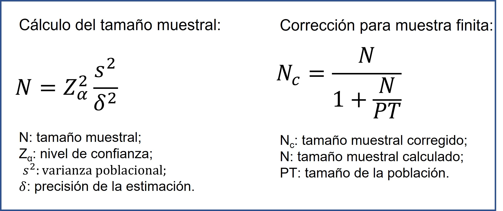
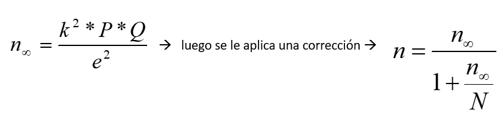
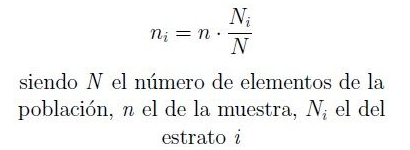

<h1 align="center"> Página para calcular tamaños muestrales según varianza o proporción conocida de la población </h1>

   

<h4>
Esta es una página solo con fines acádemicos y docentes
</h4>

Esta página fué diseñada en HTML-bootstraps y los cálculos fueron realizados usando Python con el framework de pyscript que permite incorporar el lenguaje de python en una estructura HTML.

Para el cálculo de la muestra conociendo la varianza poblacional se usó la siguiente fórmula:

Por su parte, para el cálculo de la muestra conociendo la proporción poblacional se usó la siguiente fórmula:

Para generar el tamaño de muestra según los estratos, se calculó según el criterio de afijación proporcional, usando la siguiente fórmula:

Para acceder a esta página, use el siguiente link: https://estebanlab2021.github.io/cal_muestra/

